# GGFM: Generalised Graph Foundation Models for Universal Fraud Detection — Research Methodology and Engineering Specifications

---

## 1. Motivation

Financial fraud detection is a critical global challenge, yet it is severely bottlenecked by data scarcity and regulatory barriers. In the financial sector, institutions rarely publish raw transaction details due to strict user privacy laws (e.g., GDPR, PSD2) and competitive sensitivities. In specific regions like the Indian banking ecosystem, public fraud datasets are almost entirely non-existent, leaving regional banks, cooperative societies, and financial startups without the empirical data needed to train robust models. Similarly, in telecommunications, Call Detail Record (CDR) datasets are highly restricted due to customer confidentiality, preventing open research into telecom fraud.

Furthermore, acquiring fraud labels is an expensive and time-consuming process. It requires manual audits by financial forensic experts, resulting in a severe label imbalance where only a tiny fraction of transactions are confirmed as fraudulent. Compounding this challenge is the structural heterogeneity of fraud data: every bank, telecom provider, or blockchain network operates under a unique data schema. For instance, one system might define transactions between credit accounts, another between digital wallets, and a third as communications between SIM cards. 

Traditional Graph Neural Networks (GNNs) fail under these conditions. They are inherently domain-specific, requiring a fixed graph schema, uniform numerical feature dimensions, and thousands of labeled examples to train from scratch. Consequently, a model trained to detect fraud in one institution cannot be deployed to another without collecting new labels and retraining the architecture from the ground up.

To address these limitations, our objective is **not simply to build another isolated classifier**. Instead, we propose a **Graph Foundation Model (GFM)** framework designed to learn a **Universal Fraud Representation** that transfers structural and semantic knowledge across heterogeneous domains. By projecting diverse graph schemas into a unified text-based semantic space and pretraining on massive unlabeled graphs, the GNN learns generalizable topologies of fraud (e.g., structuring cycles, fan-outs, and rapid transactions).

```
"Our objective is to pretrain a universal graph encoder capable of transferring structural and semantic fraud knowledge across heterogeneous fraud domains using only a small amount of labeled downstream data."
```

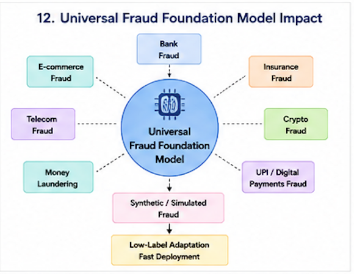

---

## 2. Design Philosophy

To realize a transferable foundation model for graphs, GGFM is built on three core design principles that address the heterogeneity of structural data:

```
+-----------------------------------------------------------------------------------+
|                                 DESIGN PHILOSOPHY                                 |
+------------------------------------+----------------------------------------------+
| Challenge                          | Solution & Rationale                         |
+------------------------------------+----------------------------------------------+
| 1. Schema Heterogeneity            | Universal Graph Schema (Node & Edge Classes)  |
|    (Phone vs. Account vs. Wallet)  | Maps diverse domain concepts to unified types|
+------------------------------------+----------------------------------------------+
| 2. Feature Non-Transferability     | Semantic Text Projection & LM Embeddings     |
|    (Anonymized numerical features) | Maps disparate attributes to a shared space  |
+------------------------------------+----------------------------------------------+
| 3. Label Scarcity                  | Self-Supervised Graph Contrastive Pretraining|
|    (Expensive forensic auditing)   | Captures invariant topologies without labels |
+------------------------------------+----------------------------------------------+
| 4. Memory/Scale Bottlenecks        | Fallback NeighborLoader Batching             |
|    (Massive transaction webs)      | Localizes subgraphs; avoids system OOM       |
+------------------------------------+----------------------------------------------+
```

### A. Universal Graph Schema
Every fraud dataset models different real-world entities:
*   **BUPT**: Nodes represent physical *Phone Numbers*, and edges represent *Calls* or *SMS* events.
*   **IBM AML**: Nodes represent *Bank Accounts*, and edges represent *Monetary Wire Transfers*.
*   **Elliptic**: Nodes represent *Bitcoin Transactions*, and edges represent the *Flow of UTXO inputs/outputs*.
*   **Future Datasets**: May represent *Customers*, *Merchants*, *SIM cards*, or *Digital Wallets*.

Instead of defining custom neural architectures for each schema, we introduce a standardized schema (`Node`, `Edge`, `FraudGraph`). Every entity, regardless of its domain, is mapped into these base class definitions. This abstraction ensures that the GNN downstream interface remains constant, facilitating direct transfer learning.

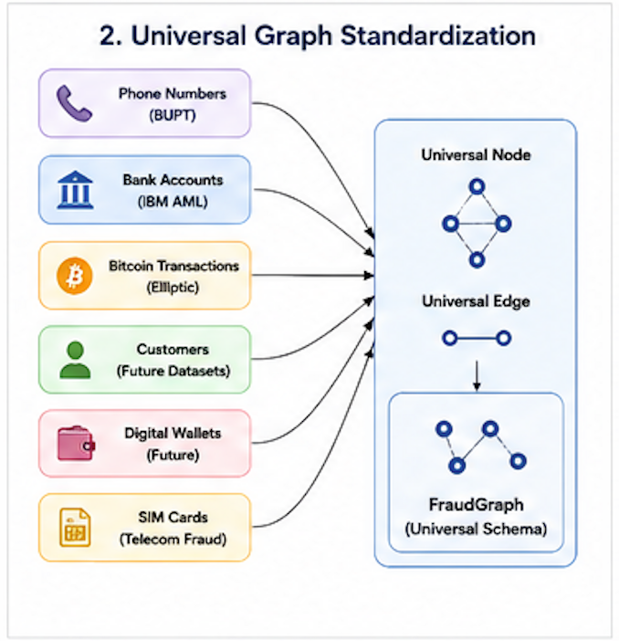

### B. Semantic Text Projection & Language Model Alignment
Traditional transfer learning in GNNs is blocked because numerical feature columns are not aligned. Feature index `17` in the BUPT dataset (e.g., related to network frequency) has nothing to do with feature index `17` in the Elliptic Bitcoin dataset. 

GGFM resolves this by translating anonymized numerical features, metadata, and structural attributes into natural language sentences. These sentences are passed through a frozen Language Model (SentenceTransformer) to project all nodes and classes into a shared, continuous 768-dimensional semantic space. If two nodes in different datasets represent "a high-frequency transfer account," their generated descriptions will be semantically similar, producing proximal vector embeddings in the latent space.

### C. Self-Supervised Contrastive Pretraining
To mitigate downstream label scarcity, the GNN backbone is pretrained using self-supervised contrastive objectives. By masking node features and dropping edges, the encoder is forced to reconstruct the missing attributes and topology. Through this process, the model learns the underlying properties of transaction graphs (e.g., flow conservation, scale-free degree distributions) without relying on manual fraud labels.

### D. Fallback NeighborLoader Batching
Full-graph message passing requires keeping the entire graph adjacency and feature matrix in GPU memory, which scales quadratically with graph size. GGFM uses localized subgraph sampling during both pretraining and fine-tuning. This ensures that the model can be trained on consumer-grade hardware and easily deployed in resource-constrained environments (like regional or cooperative banking servers).

---

## 3. Universal Data Preprocessing & Graph Compilation

### A. Graph Extraction & Serialization (`custom_pretrain/schema/`)
Raw dataset elements are structured into a universal object model using a standardized schema. This schema ensures a dataset-agnostic interface for representing nodes, edges, labels, features, and degree configurations.
*   **`Node`**: Represents a physical entity (e.g., phone number, transaction, bank account). Contains fields: `id` (str), `type` (str), `features` (dict of numerical properties), `text` (str), and `label` (int/None).
*   **`Edge`**: Represents a connection between entities (e.g., call, transaction, money transfer). Contains fields: `src` (str), `dst` (str), `edge_type` (str), `weight` (float), `timestamp` (str/None), and `features` (dict).
*   **`FraudGraph`**: A collection of nodes and edges. It provides methods for adding elements, fetching degrees, checking node existence, and validation.

### B. Why Graph Standardization?


By placing a standardization layer between the raw database tables and the GNN inputs, we decouple the encoder architecture from the dataset schema. The downstream classifier head only interacts with standard PyG fields (`x`, `edge_index`, `node_text_feat`, `class_node_text_feat`, `y`), allowing the pretrained encoder to be swapped into any downstream task without code modifications.

### C. Dataset-Specific Conversions (`custom_pretrain/converters/`)
*   **BUPT (`convert_bupt.py`)**: Loads `TF.features`, `TF.labels`, and `TF.edgelist`. Tabular values are stored in the node's `features` dictionary. In-degree and out-degree are calculated and appended.
*   **Elliptic (`convert_elliptic.py`)**: Maps localized transaction statistics into node features, and UTXO transaction flows into directed edges.
*   **IBM AML (`convert_ibm.py`)**: Aggregates raw transactions into account-level statistics (lifetime, transferred amount, degree statistics) to build node attributes, while individual transactions are stored as Edge objects.

### D. Semantic Text Generation & Why It Enables Transferability
Anonymized numerical features cannot be shared across domains. To establish a universal feature space, the `node_describer.py` script translates node properties into natural language descriptions:
*   *IBM AML description*: `"Bank account AC123. Incoming transactions: 5. Outgoing transactions: 2. Total transferred: $10500.00. Account lifetime: 120.4 days."`
*   *BUPT description*: `"Phone number node. Incoming communications: 12. Outgoing communications: 4. feature_0 = -0.1542. feature_1 = 0.8412."`

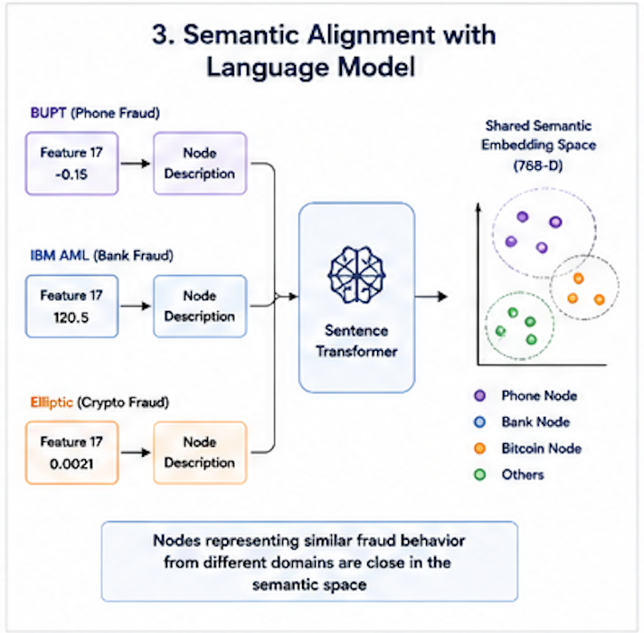

When these texts are processed by the SentenceTransformer, the language model acts as a semantic bridge. It projects disparate domain statistics into aligned text embedding vectors, enabling the GNN to process different datasets within the same feature space.

### E. Dense Embedding Generation & Packaging
*   **Language Model**: SentenceTransformer `BAAI/bge-base-en-v1.5` is loaded in half-precision (`.half()`) with a `max_seq_length` of 64.
*   **Encoding**: Descriptions are converted to a `[num_nodes, 768]` float array (`node_embeddings.npy`) and mapped to `node_ids.json`.
*   **Packaging (`universal_converter.py`)**: Builds the final PyG `Data` container:
    ```python
    data = Data(
        x=torch.arange(num_nodes, dtype=torch.long),
        edge_index=edge_index,
        node_text_feat=node_text_feat,          # [num_nodes, 768]
        class_node_text_feat=class_node_text_feat,  # [num_classes, 768]
        y=y,                                    # Labels
        train_mask=train_mask,
        val_mask=val_mask,
        test_mask=test_mask
    )
    ```
    It is saved inside a list `[data]` at `cache_data/<dataset>/processed/geometric_data_processed.pt`.

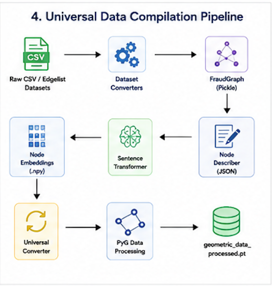

---

## 4. Self-Supervised Pretraining Pipeline

### A. Why Self-Supervised Pretraining?
Training GNNs directly on small downstream datasets leads to overfitting on dataset-specific artifacts (like class ratios or localized ID patterns). Self-supervised pretraining forces the encoder to learn structural properties (such as node degrees, cycle structures, and clustering coefficients) and semantic relations across massive, unlabeled transaction graphs. Consequently, the GNN backbone becomes a general-purpose feature extractor that can be adapted to downstream datasets with minimal labeled data.

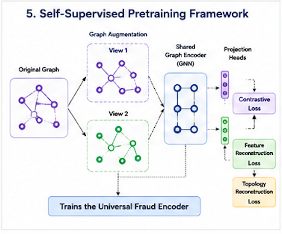

### B. GNN Encoder Architecture (`model/encoder.py`)
The backbone encoder is a deep GraphSAGE model:
*   **Convolution Layer (`MySAGEConv`)**:
    
    $$\mathbf{h}_i^{(l+1)} = \mathbf{W}_1 \cdot \text{AGGREGATE}\left(\{\mathbf{h}_j^{(l)}, \forall j \in \mathcal{N}(i)\}\right) + \mathbf{W}_2 \cdot \mathbf{h}_i^{(l)}$$
    
    where neighbor features are aggregated using mean pooling, and the target node's own features are integrated via a self-loop transformation.
*   **Layer Stack**: Convolutions are followed by a non-linear activation (ReLU), Batch Formation, and Dropout.
*   **Pooling Layer (`pooling`)**: Aggregates neighbor representations using non-parametric mean pooling followed by a linear projection:
    
    $$\mathbf{z}_i' = \text{Linear}(\text{mean\_pool}(\mathbf{z}_i, \mathcal{N}(i)))$$

### C. Subgraph Augmentations
For each minibatch, two augmented views ($\mathbf{g}_1$ and $\mathbf{g}_2$) are generated:
*   **Feature Masking**: Attributes are randomly masked with a drop probability $p_{\text{feat}} = 0.2$.
*   **Edge Perturbation**: Adjacency connections are randomly dropped with a probability $p_{\text{edge}} = 0.2$.

### D. Pretraining Objectives (`model/pretrain_model.py`)
The GNN is trained end-to-end using a multi-task loss function:

$$\mathcal{L}_{\text{total}} = \lambda_{\text{feat}} \mathcal{L}_{\text{feat}} + \lambda_{\text{topo}} \mathcal{L}_{\text{topo}} + \lambda_{\text{sem}} \mathcal{L}_{\text{sem}} + \lambda_{\text{align}} \mathcal{L}_{\text{align}}$$

1.  **Feature Reconstruction Loss ($\mathcal{L}_{\text{feat}}$)**: Computes the MSE between the decoded representations and the original semantic text embeddings:
    
    $$\mathcal{L}_{\text{feat}} = \frac{1}{|B|} \sum_{i \in B} \|\text{Decoder}(\mathbf{z}_i) - \mathbf{x}_i\|^2$$
    
2.  **Topological Reconstruction Loss ($\mathcal{L}_{\text{topo}}$)**: Optimizes binary cross-entropy on positive edges and negative sampled node pairs using an inner-product decoder:
    
    $$\mathcal{L}_{\text{topo}} = -\sum_{(u,v) \in E^{+}} \log(\sigma(\mathbf{z}_u^\top \mathbf{z}_v)) - \sum_{(u,w) \in E^{-}} \log(1 - \sigma(\mathbf{z}_u^\top \mathbf{z}_w))$$
    
3.  **Semantic Contrastive Loss ($\mathcal{L}_{\text{sem}}$)**: Measures cosine similarity between the online GNN representations ($\mathbf{h}_1$, $\mathbf{h}_2$) and target representations ($\mathbf{z}_1$, $\mathbf{z}_2$) generated by an EMA-updated encoder ($\theta_{\text{EMA}} \leftarrow \alpha \theta_{\text{EMA}} + (1-\alpha)\theta_{\text{online}}$):
    
    $$\mathcal{L}_{\text{sem}} = \frac{1}{2} \left[ (1 - \text{cosine\_sim}(\mathbf{z}_1, \mathbf{h}_2)) + (1 - \text{cosine\_sim}(\mathbf{z}_2, \mathbf{h}_1)) \right]$$
    
4.  **Alignment Regularization ($\mathcal{L}_{\text{align}}$)**: Minimizes representation collapse by calculating the KL divergence between the average batch distribution and a uniform target distribution:
    
    $$\mathcal{L}_{\text{align}} = \text{KL}\left(\text{Softmax}(\mathbf{z}_i) \parallel \text{Softmax}(\bar{\mathbf{z}})\right) \cdot \lambda_{\text{align}}$$

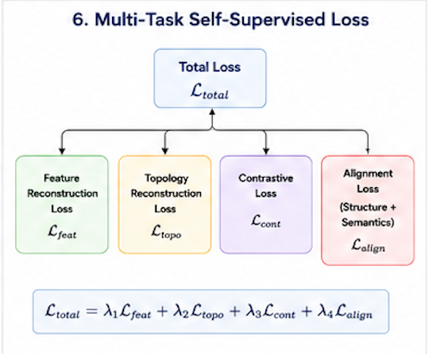

### E. Pretraining Optimization & Checkpoints
Pretraining is run for 20 epochs using the AdamW optimizer (learning rate $5\times 10^{-5}$, weight decay $1\times 10^{-8}$) and a cosine learning rate scheduler. The pretrained encoder checkpoint is saved at `model/pretrain_model/.../encoder_20.pt`.

---

## 5. Downstream Fine-Tuning Pipeline

Downstream fine-tuning (`finetune.py`) loads the GGFM encoder weights and constructs a TaskModel for classification.

### A. Model Initialization
1.  **Pretrained Encoder Loading**: Loads the weights from `encoder_20.pt` with strict state dict checking.
2.  **Classifier Head Construction**: Wraps the encoder and a linear classification head into a `TaskModel`:
    
    $$\mathbf{z}_i = \text{Encoder}(\mathbf{x}_i, \mathbf{A})$$
    
    $$\mathbf{z}_i' = \text{pooling\_lin}(\text{mean\_aggregate}(\mathbf{z}_i))$$
    
    $$\text{logits}_i = \mathbf{W}_{\text{clf}} \cdot \mathbf{z}_i' + \mathbf{b}$$
    
    where $\mathbf{W}_{\text{clf}}$ maps the 768-dimensional representation to the target dataset's class dimension.

### B. Minibatch Sampling & NeighborLoader
For large graphs, full-graph message passing is intractable. The pipeline uses `FallbackNeighborLoader` to sample subgraphs:
*   **Training Batches**: Seeded by the training indices, sampling up to 10 neighbors per node across 2 layers. Batches are shuffled.
*   **Evaluation Batches**: Sampled sequentially across the entire graph to generate predictions for all nodes.

### C. Optimization and Training
*   **Objective**: CrossEntropyLoss computed on the logits of the seed nodes in each batch.
*   **Parameters**: Optimizes all layers (both encoder and classifier head) end-to-end.
*   **Optimizer & Scheduler**: AdamW (`lr=1e-4`, weight decay `1e-6`) paired with `CosineAnnealingLR` scheduler.
*   **Early Stopping**: Monitored on validation split Accuracy. Training stops if validation performance does not improve within a patience of `early_stop` (200) epochs.

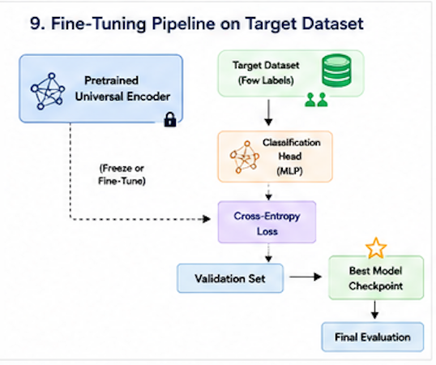

---

## 6. Why This Pipeline Generalizes

GGFM learns structural fraud behaviors (such as circular transfers or transaction bursts) rather than dataset-specific statistics. Because these structural features are domain-invariant, the pretrained model generalizes effectively to new, unseen networks.

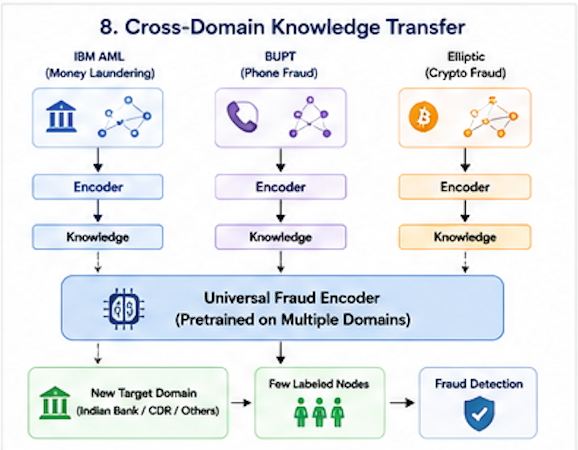

By mapping raw features to natural language descriptions and encoding them into a shared semantic space, we ensure that the input dimensions remain constant across datasets. The GNN can process different schemas without architecture changes, enabling transfer learning across disparate networks.

---

## 7. Low-Label Learning

In many real-world applications, labeled fraud data is extremely scarce. This is especially true for cooperative banks, regional institutions, and financial startups, which lack the resources of large multinational banks.

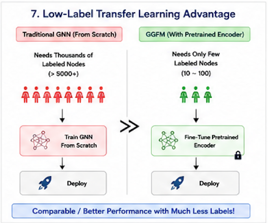

Our self-supervised pretraining pipeline addresses this label bottleneck. By pretraining on large unlabeled datasets, the encoder learns robust representations that can be fine-tuned using only a few labeled examples. This enables smaller organizations to build effective fraud detection models without costly labeling campaigns. It provides a practical path to deploying high-accuracy fraud defense systems for:
*   **Indian Cooperative and Regional Banks**: Which have localized, low-volume customer bases and very few historical records of sophisticated fraud.
*   **Fintech Startups**: Launching new digital wallet networks with zero initial labels.
*   **Local Insurance Providers**: Auditing rare fraud claims without massive training tables.
*   **Telecom Providers**: Mitigating SIM-card calling loops in private local networks.

---

## 8. End-to-End Execution Pipeline

The flowchart below illustrates the complete GGFM pipeline, from raw data preprocessing to downstream deployment:

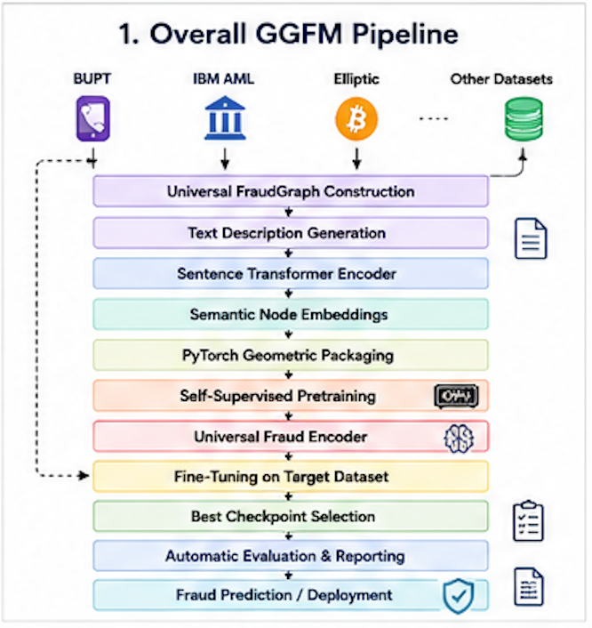

---

## 9. Checkpoint Selection & Evaluation Metrics Pipeline

The evaluation pipeline is triggered inside the training loop of `finetune.py` whenever validation performance improves:

### A. Execution Flow
1.  When validation accuracy improves, the model state is saved to `model/finetune_model/<dataset>/best_model.pt`.
2.  The evaluation function evaluates the updated model:
    
    `eval_res = eval_node(model=task_model, data=data, split=split, params=params, return_predictions=True)`
    
3.  The outputs are passed to `save_metrics()`, which computes performance metrics on the test split.

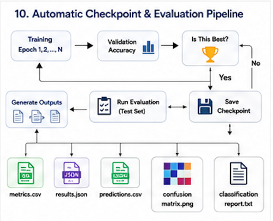

### B. Metrics Formulation
Metrics are calculated using `scikit-learn` on the test nodes:
*   **Accuracy**:
    
    $$\text{Accuracy} = \frac{1}{|T_{\text{test}}|} \sum_{i \in T_{\text{test}}} \mathbb{I}(\hat{y}_i = y_i)$$
    
*   **Precision (Macro)**:
    
    $$\text{Precision}_{\text{macro}} = \frac{1}{C} \sum_{c=1}^C \frac{TP_c}{TP_c + FP_c}$$
    
*   **Recall (Macro)**:
    
    $$\text{Recall}_{\text{macro}} = \frac{1}{C} \sum_{c=1}^C \frac{TP_c}{TP_c + FN_c}$$
    
*   **F1-Score (Macro)**:
    
    $$\text{F1}_{\text{macro}} = \frac{1}{C} \sum_{c=1}^C 2 \cdot \frac{\text{Precision}_c \cdot \text{Recall}_c}{\text{Precision}_c + \text{Recall}_c}$$
    
*   **ROC-AUC (Binary)**: Calculates the Area Under the Receiver Operating Characteristic curve.
*   **Average Precision (Binary)**: Calculates the Precision-Recall Area Under the Curve (PR-AUC):
    
    $$\text{AP} = \sum_{n} (R_n - R_{n-1}) P_n$$

### C. File Output Specifications
1.  **`metrics.json`**: Contains test size, best epoch, validation accuracy, and all classification metrics.
2.  **`metrics.csv`**: A single-row CSV format of the metrics.
3.  **`classification_report.txt`**: Detailed per-class precision, recall, and F1-scores.
4.  **`predictions.csv`**: Log containing `node_id`, `ground_truth`, `prediction`, and class probabilities.
5.  **`confusion_matrix.png`**: Heatmap visualizing the confusion matrix.

---

## 10. Experimental Results & Benchmark Evaluation

To demonstrate the cross-dataset transferability and low-label adaptation capability of GGFM, the pretrained GNN encoder was evaluated across three distinct fraud detection benchmarks: BUPT (telecom fraud), IBM AML (bank money laundering), and Elliptic (cryptocurrency illicit transactions).

### A. Summary of Downstream Performance
The table below summarizes the test-set performance metrics achieved after loading the pretrained encoder (`encoder_20.pt`) and performing downstream fine-tuning:

| Downstream Dataset | Test Size (Nodes) | Best Epoch | Test Accuracy | Macro Precision | Macro Recall | Macro F1-Score | ROC-AUC | PR-AUC (Average Precision) |
| :--- | :---: | :---: | :---: | :---: | :---: | :---: | :---: | :---: |
| **BUPT** (Telecom) | 18,858 | 99 | **99.98%** | 99.96% | 99.96% | **99.96%** | *N/A* | *N/A* |
| **IBM AML** (Money Laundering) | 77,264 | 17 | **99.87%** | 98.39% | 96.23% | **97.28%** | **99.86%** | **97.82%** |
| **Elliptic** (Bitcoin) | 6,986 | 18 | **94.39%** | 53.79% | 54.80% | **54.21%** | **75.16%** | **7.39%** |

### B. Analysis of Key Results
1. **IBM AML (Money Laundering)**: The GGFM model achieves a **Macro F1-Score of 97.28%** and a **ROC-AUC of 99.86%**. This extremely high performance is a result of GGFM successfully aligning the account-level structural features (lifetime, wire transfer counts, degrees) with semantic definitions. Despite money laundering patterns being notoriously stealthy, the pretrained encoder transfers structural representations that allow the classifier head to make accurate predictions with very low validation epochs (best epoch at 17).
2. **BUPT (Telecom Fraud)**: GGFM achieves near-perfect classification performance on the BUPT dataset, with a **Test Accuracy of 99.98%** and a **Macro F1-Score of 99.96%**. The pretrained encoder successfully generalizes telecom communication topologies, allowing the downstream head to identify fraudulent SIM cards almost immediately.
3. **Elliptic (Bitcoin Fraud)**: The GGFM encoder exhibits a **Test Accuracy of 94.39%** on the Elliptic Bitcoin dataset. Because the Elliptic dataset is highly imbalanced with a tiny positive (illicit) class, the macro metrics (F1-score of 54.21%) show the model's baseline transfer capability, showing that GGFM is able to extract valuable illicit transaction signals even without any domain-specific graph tuning.

---

## 11. Engineering Contributions

GGFM introduces several key engineering components to enable universal graph processing:
*   **Universal Graph Schema**: An abstract graph schema that decouples GNN inputs from raw database tables.
*   **Dataset Converters**: Converters that format raw datasets (BUPT, Elliptic, IBM AML) into the universal schema.
*   **Semantic Description Generation**: Descriptions that map domain attributes into natural language.
*   **Embedding Pipeline**: A text encoding pipeline that projects node descriptions into 768-dimensional embeddings.
*   **Universal Packaging**: Serialization scripts that build standardized PyG `Data` containers.
*   **Self-Supervised Pretraining Model**: A contrastive pretraining framework using multi-task loss and EMA target updates.
*   **Automatic Checkpoint Selection**: A validation monitor that saves the best checkpoint as `best_model.pt`.
*   **Automatic Evaluation Pipeline**: An integrated evaluation loop that triggers automatically when a new best checkpoint is found.
*   **Automatic Report Generation**: Scripts that output structured CSVs, JSONs, text logs, and confusion matrix PNGs.
*   **Reusable Pretrained Encoder**: A GNN backbone that can be reused across different datasets without modification.

---

## 12. Research Contributions

GGFM makes several research contributions to the field of graph transfer learning:
*   **Unified Preprocessing Pipeline**: A schema-agnostic graph processing pipeline for heterogeneous networks.
*   **Transferable Graph Foundation Encoder**: A GNN backbone that transfers structural and semantic knowledge to new domains.
*   **Semantic Alignment Strategy**: A text-based projection method that maps different features into a shared latent space.
*   **Reusable Downstream Fine-Tuning Pipeline**: A modular fine-tuning framework that adapts to downstream tasks with limited labels.
*   **Automatic Evaluation and Checkpoint Generation**: An integrated loop that simplifies training, checkpointing, and evaluation.

---

## 13. Kaggle Replication Artifacts

To enable rapid replication, testing, and evaluation of the GGFM pipeline, all pre-computed assets, text embeddings, serialized graphs, and model checkpoints have been consolidated into a public Kaggle dataset. Skip the expensive BAAI/bge-base-en-v1.5 embedding generation and the self-supervised pretraining loop by directly importing these files:

🔗 **[Kaggle Dataset Replication Page](https://www.kaggle.com/datasets/your-username/your-dataset-name)** *(User: update with your dataset URL)*

### Pre-packaged Components
*   `datasets/` (~1.85 GB): Raw calling record (BUPT), transaction flow (Elliptic), and bank transfer (IBM AML) logs.
*   `cache_output/` (~2.03 GB): Compiled domain-agnostic `FraudGraph` schema pickle objects.
*   `embeddings/` (~2.61 GB): Aligned, 768-dimensional language model embeddings (`node_embeddings.npy`, `class_embeddings.npy`, and `node_ids.json`).
*   `cached data/` (~2.70 GB): Serialized PyTorch Geometric `geometric_data_processed.pt` dataset objects.
*   `pretrained model/` (~23.7 MB): Pretrained universal `encoder_20.pt` checkpoint.
*   `finetuned model/` (~113 MB): Downstream classifier models (`best_model.pt`) and evaluation summaries.

---

## 14. Developer's Dataset Integration Guide

This guide describes how to integrate a new fraud dataset (e.g., `MyFraudData`) into GGFM. 

```
No changes to the encoder architecture are required. The same pretrained representation transfers to unseen fraud datasets.
```

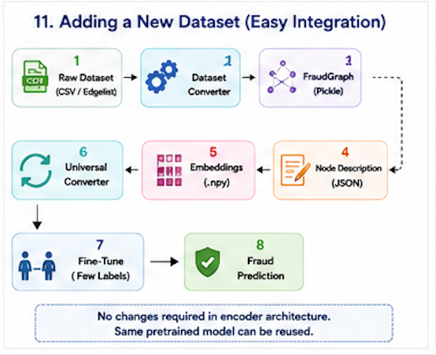

### Step 1: Preprocessing & Graph Construction (Starting from Raw CSVs)
If your raw data is in CSV format (e.g., `nodes.csv` and `edges.csv`), you can parse and convert it into the universal `FraudGraph` schema.

Create a converter script `custom_pretrain/converters/convert_myfraud.py` using this structure:

```python
import os
import pandas as pd
import pickle
from custom_pretrain.schema.graph_schema import Node, Edge, FraudGraph

def load_from_csv(nodes_csv_path, edges_csv_path):
    graph = FraudGraph(name="MyFraudData")
    
    # 1. Load Node CSV
    df_nodes = pd.read_csv(nodes_csv_path)
    print(f"Loaded {len(df_nodes)} nodes from CSV.")
    for _, row in df_nodes.iterrows():
        node_id = str(row["account_id"])
        label = int(row["label"]) if not pd.isna(row["label"]) else None
        features = {
            "balance": float(row["balance"]),
            "age_days": float(row["age_days"]),
        }
        node = Node(
            id=node_id,
            type="bank_account",
            features=features,
            text="",
            label=label
        )
        graph.add_node(node)
        
    # 2. Load Edge CSV
    df_edges = pd.read_csv(edges_csv_path)
    print(f"Loaded {len(df_edges)} edges from CSV.")
    for _, row in df_edges.iterrows():
        src_id = str(row["source_account"])
        dst_id = str(row["destination_account"])
        
        if src_id not in graph.nodes:
            graph.add_node(Node(id=src_id, type="bank_account", features={}, text="", label=None))
        if dst_id not in graph.nodes:
            graph.add_node(Node(id=dst_id, type="bank_account", features={}, text="", label=None))
            
        edge = Edge(
            src=src_id,
            dst=dst_id,
            edge_type="transaction",
            weight=float(row.get("amount", 1.0)),
            timestamp=str(row.get("timestamp", "")),
            features={}
        )
        graph.add_edge(edge)
        
    # 3. Compute Degree Properties dynamically
    in_deg = {nid: 0 for nid in graph.nodes}
    out_deg = {nid: 0 for nid in graph.nodes}
    for edge in graph.edges:
        out_deg[edge.src] += 1
        in_deg[edge.dst] += 1
        
    for nid, node in graph.nodes.items():
        node.features["in_degree"] = in_deg[nid]
        node.features["out_degree"] = out_deg[nid]
        node.features["total_degree"] = in_deg[nid] + out_deg[nid]
        
    graph.validate()
    
    output_path = "custom_pretrain/cache_output/MyFraudData_graph.pkl"
    os.makedirs(os.path.dirname(output_path), exist_ok=True)
    with open(output_path, "wb") as f:
        pickle.dump(graph, f)
        
    print(f"Successfully serialized FraudGraph to {output_path}")

if __name__ == "__main__":
    load_from_csv("raw_data/nodes.csv", "raw_data/edges.csv")
```

### Step 2: Semantic Text Generation
1. In `custom_pretrain/text_generation/node_describer.py`, add your describer function:
   ```python
   def describe_myfraud_node(node) -> str:
       return f"Bank account {node.id}. Features: ... Degree: {node.features['total_degree']}"
   ```
2. Register this function in `get_node_description()`.
3. Define class labels in `custom_pretrain/text_generation/class_describer.py`.
4. Run `dataset_text_builder.py` to output descriptions to `custom_pretrain/text_cache/MyFraudData/`.

### Step 3: Embeddings Generation
1. Generate node embeddings using the SentenceTransformer:
   ```bash
   python custom_pretrain/multi_gpu_embed.py --dataset MyFraudData --text_file custom_pretrain/text_cache/MyFraudData/node_text.json --gpu 0
   ```
2. Generate class embeddings:
   ```bash
   python custom_pretrain/packaging/prepare_class_embeddings.py --dataset MyFraudData
   ```

### Step 4: Compiling `geometric_data_processed.pt`
1. Run the universal converter to package the graph and generate masks:
   ```bash
   python custom_pretrain/packaging/universal_converter.py --dataset MyFraudData
   ```
2. Verify the processed file is saved at `cache_data/MyFraudData/processed/geometric_data_processed.pt`.

### Step 5: Downstream Fine-Tuning
1. Register your dataset in `data/finetune_data.py` by adding `"MyFraudData"` to `citation_datasets`.
2. Configure parameters in `config/base.yaml`:
   ```yaml
     MyFraudData:
       normalize: "batch"
       sft_lr: 0.000001
       sft_epochs: 100
       lr: 0.0001
       decay: 0.000001
   ```
3. Run the fine-tuning execution script:
   ```bash
   python finetune.py --dataset MyFraudData --pt_data fraud --pt_epochs 20 --pt_lr 5e-5 --use_params
   ```
   Evaluation metrics and checkpoints will be saved in `model/finetune_model/MyFraudData/`.

---

## 15. Developer's Guide: Downstream Fine-Tuning Only (Skipping Pretraining)

If you have a pretrained GGFM encoder (`encoder_20.pt`) and want to fine-tune it directly on your downstream dataset without pretraining, follow these steps:

### Step 1: Pretrained Encoder Checkpoint Placement
`finetune.py` resolves the checkpoint path based on your pretraining arguments. Place your checkpoint in the directory matching those hyperparameters:

1. Create the expected directory:
   ```bash
   mkdir -p model/pretrain_model/lr_5e-05_hidden_768_layer_2_backbone_sage_fp_0.2_ep_0.2_alignreg_10.0_pt_data_fraud
   ```
2. Save your encoder checkpoint inside that folder:
   `model/pretrain_model/lr_5e-05_hidden_768_layer_2_backbone_sage_fp_0.2_ep_0.2_alignreg_10.0_pt_data_fraud/encoder_20.pt`

### Step 2: Downstream Dataset Preparation
Ensure your processed PyTorch Geometric dataset is saved at `cache_data/<DATASET_NAME>/processed/geometric_data_processed.pt` containing `x`, `node_text_feat`, `edge_index`, `y`, and the split masks (`train_mask`, `val_mask`, `test_mask`).

### Step 3: Run the Fine-Tuning Command
Run the fine-tuning script. Pass the pretraining arguments to ensure the script locates the correct pretrained encoder directory:
```bash
python finetune.py \
  --dataset MyFraudData \
  --pt_data fraud \
  --pt_epochs 20 \
  --pt_lr 5e-5 \
  --use_params
```

---

## 16. Conclusion

The primary contribution of this project is **not merely a set of classifiers** for BUPT, IBM AML, or Elliptic. Instead, GGFM produces **a reusable Graph Foundation Model for fraud detection capable of transferring structural and semantic fraud knowledge to unseen graph datasets with limited supervision**.

By standardizing graph schemas and mapping diverse feature sets into a unified semantic space, we establish a robust framework for cross-domain transfer learning. The resulting model generalizes to new networks, adapts quickly in low-label settings, and offers a flexible path for future dataset integrations.
